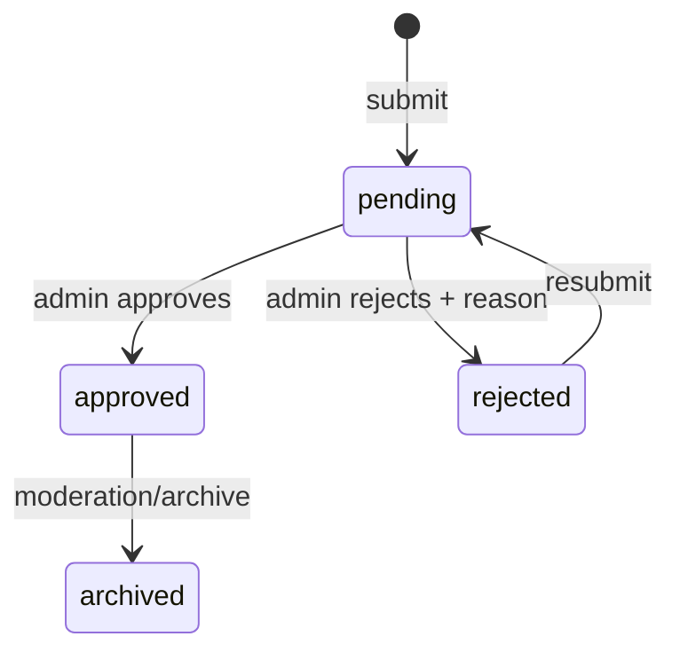

# Architecture, Data and Privacy Baseline

## Proposed web architecture

`Browser UI → API / Auth boundary → Domain services (Report, Moderation, Community, Learning) → PostgreSQL + object storage → Audit log`

The public community reads a deliberately shaped `PublicReportView`; it never receives the private submitter object. The moderation service owns state transitions. The Learning service owns class membership, assignments and private feedback. This separation keeps school privacy enforceable as the product grows.

## Report state machine

## Public/private projection

| Private submission | Public report view |
|---|---|
| submitterUserId | omitted |
| studentName/avatar/classId | omitted |
| exactCoordinates | generalised area / optional grid |
| species, description, image, observedAt | retained after approval |
| moderation decision and audit | retained as verification badge, not internal notes |

## Security decisions

- Enforce RBAC in the API and database query layer; do not rely on UI-only hiding.
- Apply least privilege: a teacher query is constrained by `class.teacherId = currentUser.id`.
- Log actor, timestamp, old state, new state, reason and correlation ID for moderation.
- Encrypt sensitive data at rest and in transit; define retention/deletion workflow for child records.
- Generalise sensitive wildlife locations and provide a report abuse/appeal path.
